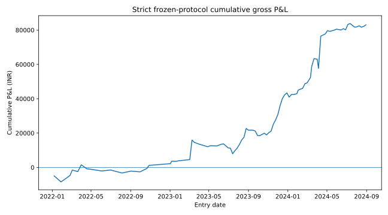
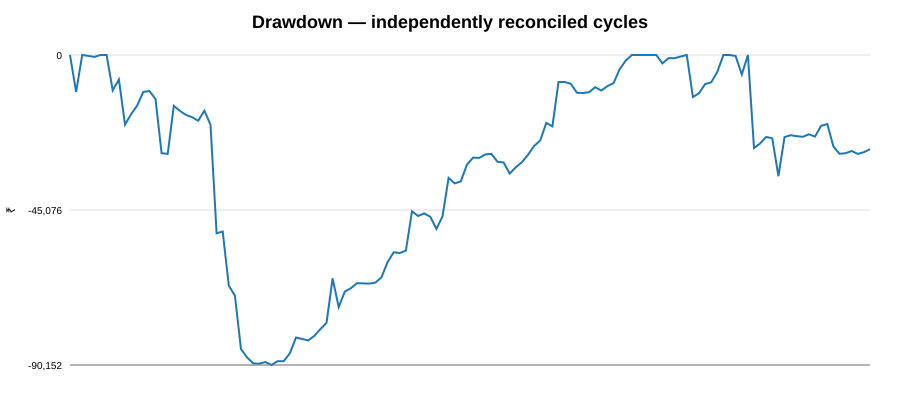
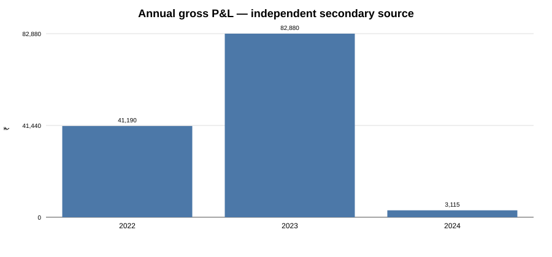
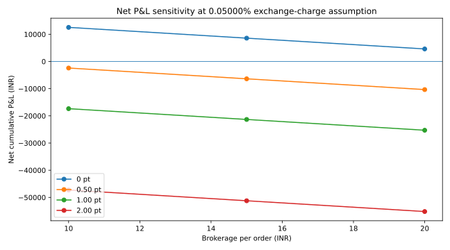

# A Reproducible Historical Study of a Frozen Four-Leg NIFTY Weekly/Three-Week Calendar Structure, 2022-2024

## Abstract

This manuscript evaluates a mechanically frozen four-leg NIFTY 50 index-option calendar structure over the 2022-2024 historical window. The rule enters on the first trading day after the preceding weekly expiry at the session open, buys the near-expiry at-the-money put, sells the near-expiry at-the-money call, buys the same-strike call in the expiry three weekly intervals farther out, sells the same-strike far-expiry put, and closes all four legs at the near-expiry session close. No signal overlay, adjustment, rolling, averaging, stop, target, or post-hoc filter is permitted.

The initial public-data backtest produced 59 executable cycles out of 134 candidate cycles, or 44.0% coverage. The principal validation question was whether the missing 75 cycles represented genuine market non-execution or incomplete primary data. An independent public mirror of NSE F&O bhavcopy archives was therefore used as a secondary contract source. All 75 primary-source rejections were reconstructed on that independent source. Overall, 132 of 134 candidate cycles were complete on the independent source, giving 98.5% coverage. Fifty-seven of the 59 primary-valid cycles were also complete on the independent source; two primary-valid cycles remained source discrepancies because the independent file set contained no common strike under the frozen same-strike rule.

On the independently reconciled 132-cycle ledger, gross P&L was ₹127,185.00, mean cycle P&L ₹963.52, win rate 57.58%, profit factor 1.542, and maximum drawdown ₹90,152.50. The best cycle was ₹62,080.00 and the worst was ₹-31,597.50. The uncertainty analysis in the repository uses a circular three-cycle block bootstrap with a fixed seed so that the reported interval is reproducible.

Transaction costs are modeled using the historically documented Paytm Money brokerage cohorts of ₹10, ₹15 and ₹20 per executed order, statutory charges, GST, exchange-charge sensitivities of 0.03503%, 0.05000% and 0.05300% of option premium turnover, and adverse slippage of 0.25, 0.50, 1.00 and 2.00 index points per execution. At a 0.05000% exchange-charge sensitivity and 0.50-point slippage, modeled cumulative net P&L ranges from about ₹80,818 to ₹68,357 across the ₹10/₹20 brokerage cohorts. At 2.00-point slippage, the same sensitivity ranges from about ₹7,768 to ₹-4,693.

The main methodological conclusion is that the original 44.0% executable coverage was primarily a source-coverage problem in the public primary dataset rather than an intentional strategy filter. The research does not infer future profitability from the historical result alone.

**Keywords:** NIFTY 50, weekly options, calendar spread, options backtest, transaction costs, slippage, data validation, expiry effects, reproducibility.

## 1. Research questions

### Primary question
Does the frozen four-leg NIFTY weekly/three-week calendar structure produce positive historical expected return after realistic transaction costs and execution slippage over the 2022-2024 sample?

### Validation questions
1. How many candidate cycles can be reconstructed from the primary source?
2. Are primary-source non-executions genuine market non-trades or data-coverage failures?
3. Does an independent historical option source reproduce the required contracts?
4. How sensitive are results to slippage and historical Paytm Money cost scenarios?
5. How stable are results across years and under dependence-aware resampling?

## 2. Aims and objectives

The study aims to establish a reproducible historical research pipeline rather than optimize a trading rule.

The objectives are to freeze the strategy definition before analysis; build a deterministic historical engine; validate source schemas, expiry calendars and lot sizes; quantify primary-source coverage; independently reconcile the candidate population; quantify performance and drawdown; model transaction-cost sensitivity; retain all implementation errors; and produce a reproducible manuscript and audit trail.

## 3. Literature and market-structure context

Weekly index options create a distinct short-horizon information and volatility environment around expiries. Jain and Kotha (2022) studied the introduction of weekly index options on NIFTY50 and evaluated information absorption and volatility. Andersen, Fusari and Todorov (2017) examined short-term risks implied by weekly options more generally. Calendar-spread research in other markets emphasizes the interaction between time to expiry and volatility term structure. These works provide context but do not validate this particular frozen four-leg rule.

The historical NIFTY contract environment is versioned rather than assumed constant. The research uses actual historical expiry records and historically applicable lot sizes. The strategy specification, exchange references, and expiry-rule versioning are documented in docs/nifty_calendar/STRATEGY_LOCK.md and docs/nifty_calendar/SOURCES.md.

## 4. Frozen strategy specification

The frozen rule is:

- Entry date: first trading day after the previous NIFTY weekly expiry.
- Entry time: 09:15 IST market-open bar.
- ATM strike: nearest listed strike to the NIFTY 50 spot open.
- Leg 1: buy one near-expiry ATM PE.
- Leg 2: sell one near-expiry ATM CE.
- Leg 3: buy one far-expiry ATM CE at the same strike.
- Leg 4: sell one far-expiry ATM PE at the same strike.
- Far expiry: the weekly expiry exactly three weekly intervals after the near expiry using the actual historical expiry sequence.
- Exit: close all four legs on the near-expiry trading day using daily contract CLOSE.
- Quantity: one historical lot per leg.
- No adjustments, target, stop, roll, averaging, signal overlay, or strike migration.

Daily OHLC is therefore sufficient for the frozen endpoint protocol, while the study explicitly recognizes that daily OHLC does not prove simultaneous executable fills.

## 5. Data and validation design

### 5.1 Primary source
The primary historical option dataset is a public NIFTY options archive normalized to daily contract records. The source used a single-letter C/P option-type convention, which was explicitly mapped to the engine's CE/PE labels after a source-schema diagnostic.

### 5.2 Independent source
The secondary contract source is the public GitHub mirror SantoshSrinivas79/NSE-FNO-Data-bank, which stores daily NSE F&O bhavcopy ZIP archives across the research period. It is used as an independent public mirror for cross-source reconciliation rather than as an official exchange endpoint.

### 5.3 Independent spot diagnostic
Yahoo Finance NIFTY 50 daily OPEN was used as a cross-source diagnostic on candidate entry dates. Yahoo spot was not allowed to redefine the frozen strategy's primary strike-selection input.

### 5.4 Candidate-cycle audit
The frozen expiry engine generated 134 candidate cycles. The primary source produced 59 executable cycles and rejected 75.

| Primary rejection | Cycles |
|---|---:|
| Missing entry leg | 48 |
| Missing entry and missing exit leg | 16 |
| No common strike | 9 |
| Missing exit leg | 2 |
| **Total rejected** | **75** |

The independent source completed 132 of all 134 candidate cycles:

| Secondary classification | Cycles |
|---|---:|
| Recovered primary rejects | 75 |
| Primary-valid and secondary-complete | 57 |
| Primary-valid and secondary-non-executable | 2 |
| **Total candidates** | **134** |

The critical coverage result is that all 75 primary-source rejections were reconstructed as complete cycles in the independent public source. The two remaining discrepancies are primary-valid cycles for which the independent source has no common strike under the frozen same-strike requirement.

## 6. Methods

### 6.1 P&L
For each complete cycle, gross P&L is the sum of four leg-level price changes multiplied by the historically applicable lot size: long near PE change, reverse change for short near CE, long far CE change, and reverse change for short far PE.

Primary implementation: src/nifty_calendar/backtest.py.
Secondary implementation: scripts/build_secondary_trade_ledger.py.

### 6.2 Descriptive statistics
The study reports sample size, total P&L, mean, median, win rate, profit factor, maximum drawdown, best trade, worst trade, and annual decomposition.

### 6.3 Dependence-aware inference
Weekly cycles are not assumed independent. A circular three-cycle block bootstrap is used as a resampling diagnostic with 20,000 replications and fixed seed 20260923. The exact output is generated by scripts/compute_secondary_statistics.py and is retained as a reproducible repository artifact.

### 6.4 Transaction-cost model
The historical Paytm Money public pricing record supports multiple brokerage cohorts. The study therefore uses ₹10, ₹15 and ₹20 per executed order rather than guessing one user-specific historical rate. Eight option executions occur per complete four-leg cycle.

Statutory and regulatory assumptions are documented in docs/nifty_calendar/COST_ASSUMPTIONS.md: option-sale STT applicable before 1-Oct-2024, buy-side stamp duty, SEBI fee, GST, and exchange-charge sensitivities. Slippage is charged separately per execution using the historical lot size of the relevant leg.

## 7. Results

### 7.1 Primary-source result

| Metric | Primary source |
|---|---:|
| Cycles | 59 |
| Coverage | 44.0% |
| Gross P&L | ₹52,827.50 |
| Mean cycle | ₹895.38 |
| Median cycle | ₹866.25 |
| Win rate | 64.41% |
| Profit factor | 2.549 |
| Maximum drawdown | ₹5,650.00 |

This is retained as a provenance result, not as the final population estimate, because primary-source coverage was incomplete.

### 7.2 Independently reconciled result

| Metric | Independent secondary source |
|---|---:|
| Complete cycles | 132 / 134 |
| Coverage | 98.5% |
| Gross P&L | ₹127,185.00 |
| Mean cycle | ₹963.52 |
| Win rate | 57.58% |
| Profit factor | 1.542 |
| Maximum drawdown | ₹90,152.50 |
| Best cycle | ₹62,080.00 |
| Worst cycle | ₹-31,597.50 |

### 7.3 Annual decomposition

| Year | Complete cycles | Gross P&L (₹) | Mean cycle (₹) |
|---:|---:|---:|---:|
| 2022 | 46 | 41,190.00 | 895.43 |
| 2023 | 51 | 82,880.00 | 1,625.10 |
| 2024 | 35 | 3,115.00 | 89.00 |

The aggregate result is not evenly distributed across years. The 2024 component is small relative to the 2022 and 2023 contributions.

### 7.4 Primary-versus-secondary cross-source comparison

Of the 59 cycles executable in the primary source, 57 were complete in the independent source. Across those matched cycles, the repository comparison reports primary gross P&L of ₹49,940.00 and secondary gross P&L of ₹58,788.75. The secondary-minus-primary aggregate difference is ₹8,848.75, with mean difference ₹155.24 and high cycle-level correlation. The maximum within-cycle leg-price discrepancy is retained in the P5 reconciliation report rather than treated as a fill-quality claim.

## 8. Execution-cost sensitivity

At a 0.05000% exchange-charge sensitivity, the modeled cumulative net results are:

| Paytm brokerage cohort | 0 pt slippage | 0.50 pt | 1.00 pt | 2.00 pt |
|---|---:|---:|---:|---:|
| ₹10/order | ₹105,167.95 | ₹80,817.95 | ₹56,467.95 | ₹7,767.95 |
| ₹15/order | ₹98,937.55 | ₹74,587.55 | ₹50,237.55 | ₹1,537.55 |
| ₹20/order | ₹92,707.15 | ₹68,357.15 | ₹44,007.15 | ₹-4,692.85 |

These are modeled sensitivities, not reconstructed contract-note fills.

## 9. Interpretation of the original 56% non-trading issue

The initial 44.0% executable coverage should not be interpreted as an intrinsic property of the strategy. The evidence instead indicates that the public primary source omitted required contract observations for 75 candidate cycles. An independent source reconstructed all 75.

The correct interpretation is narrower than saying that every recovered cycle could have been filled in live markets. The reconciliation proves the historical contract records exist in the independent source; it does not prove bid/ask execution, queue priority, leg synchronization, or market-impact-free fills.

## 10. Discussion

### 10.1 What is established
The frozen structure is mechanically reconstructible across nearly the entire 2022-2024 candidate population when cross-source validation is applied. The original subset result was materially affected by source coverage.

### 10.2 What remains uncertain
The gross cumulative result is positive, but the sample is small, drawdown is substantial, and the study does not establish a stable future expected return. The exact historical bootstrap interval is generated by the repository statistics script rather than hard-coded as an inferential conclusion.

### 10.3 Cost dependence
Modeled net P&L changes substantially with execution assumptions. This is expected for a four-leg structure with eight executions per cycle and is one reason the research does not rely on gross P&L alone.

### 10.4 Regime context
No regime filter was added to the frozen backtest. Potential explanatory variables for later research include India VIX, realized-volatility regime, NIFTY trend, FII/DII flows, USD/INR, global equities, gold, rates, event/news calendars, option volume and open interest. Introducing these into the decision rule would create a new research phase rather than modifying this frozen result.

## 11. Strengths

1. Strategy definition was frozen before performance interpretation.
2. Historical expiry calendars and lot sizes were versioned.
3. Two-source reconciliation addressed the main data-coverage failure mode.
4. Errors and corrections are retained in docs/nifty_calendar/ERROR_LOG.md.
5. GitHub Actions and cached inputs provide a reproducible execution path.
6. Slippage and cost assumptions are modeled at leg/execution level.
7. No post-hoc strategy optimization was introduced.

## 12. Limitations

### Source provenance
The independent contract source is a public mirror of NSE F&O bhavcopy data rather than a directly authenticated exchange feed.

### Execution realism
Daily OHLC does not model bid/ask spread, market impact, queue position, partial fills, order-routing latency, leg synchronization or outages.

### Two unresolved source discrepancies
Two primary-valid cycles remain unconstructible on the independent source because that source contains no common strike. They are retained as discrepancies rather than silently imputed.

### Capital efficiency
Margin requirements, collateral interest, financing cost and dynamic broker margin were not reconstructed, so P&L is not a return-on-capital measure.

### External regime variables
The study intentionally does not condition the frozen rule on VIX, FII/DII, global markets, news or other contextual variables.

## 13. Conclusion

The main methodological finding is that the initial 44.0% executable coverage was not a defensible estimate of how often the frozen strategy could be reconstructed from historical market records. An independent public mirror of NSE F&O bhavcopy archives recovered all 75 cycles rejected by the primary source, and 132 of 134 candidate cycles were complete on the independent source.

On the 132-cycle independently reconciled ledger, cumulative gross P&L was ₹127,185.00 with a 57.58% win rate and 1.542 profit factor, while maximum drawdown was ₹90,152.50. Transaction-cost sensitivity shows that modeled net outcomes depend materially on brokerage cohort, exchange-charge assumptions and slippage. The study therefore does not claim a stable future trading edge from this historical sample alone.

## 14. Future research

1. Extend the exact frozen protocol to a longer historical window with versioned contract calendars.
2. Add a strictly out-of-sample post-2024 validation period under the revised expiry regime.
3. Use intraday bid/ask or tick data for synchronized four-leg execution replay.
4. Add liquidity, volume, open-interest and spread constraints.
5. Stratify outcomes by VIX, realized volatility, trend, FII/DII, global risk conditions, USD/INR, gold, rates and news/event regimes without modifying the frozen historical result.
6. Replace public cost sensitivities with exact client contract-note charges when historical Paytm Money evidence becomes available.

## Appendix A — Reproducibility files

- docs/nifty_calendar/STRATEGY_LOCK.md
- docs/nifty_calendar/RESEARCH_PLAN.md
- docs/nifty_calendar/PHASE_STATUS.md
- docs/nifty_calendar/ERROR_LOG.md
- docs/nifty_calendar/CONVERSATION_LOG.md
- docs/nifty_calendar/SOURCES.md
- docs/nifty_calendar/COST_ASSUMPTIONS.md
- reports/nifty_calendar/P5_RECONCILIATION_REPORT_2022_2024.md
- reports/nifty_calendar/P5_SECONDARY_RECONCILIATION_2022_2024.csv
- reports/nifty_calendar/SECONDARY_FULL_TRADE_LEDGER_2022_2024.csv
- reports/nifty_calendar/SECONDARY_TRADE_LEVEL_RESULTS_2022_2024.csv
- reports/nifty_calendar/SECONDARY_COST_SENSITIVITY_2022_2024.csv
- scripts/build_secondary_trade_ledger.py
- scripts/compute_secondary_statistics.py

## Appendix B — References

1. NSE India, NIFTY 50 equity-derivatives product information: https://www.nseindia.com/static/products-services/equity-derivatives-nifty50
2. NSE India, equity-derivatives contract specifications: https://www.nseindia.com/static/products-services/equity-derivatives-contract-specifications
3. NSE circular 68747, revision of NIFTY/stock derivative expiry day: https://nsearchives.nseindia.com/web/sites/default/files/inline-files/FAOP68747.pdf
4. NSE circular 64625, revision of index derivative contract size: https://nsearchives.nseindia.com/content/circulars/FAOP64625.pdf
5. NSE circular 47854, revision of NIFTY market lot: https://archives.nseindia.com/content/circulars/FAOP47854.pdf
6. Paytm Money, brokerage cohort announcement of 25-Aug-2023: https://www.paytmmoney.com/blog/brokerage-charges-increase-from-25th-aug-23-existing-users-will-continue-on-old-brokerage-charges/
7. Paytm Money, pricing updates: https://www.paytmmoney.com/blog/all-new-paytm-money-updates-revisions-and-more/
8. Paytm Money F&O FAQ: https://www.paytmmoney.com/stocks/customer/fno-faq/onboarding-and-kyc/account-segment-activation/how-to-activate-fo-from-mobile-app-web
9. Jain, P. & Kotha, K. (2022). Does options improve the information absorption? Evidence from the introduction of weekly index options. International Review of Finance, 22(4), 770-776. https://doi.org/10.1111/irfi.12372
10. Andersen, T. G., Fusari, N. & Todorov, V. (2017). Short-Term Market Risks Implied by Weekly Options. NBER Working Paper 21491. https://www.nber.org/papers/w21491
11. Schneider, L. & Tavin, B. (2018). Calendar-spread option literature relevant to term-structure effects. Journal of Banking & Finance. https://www.sciencedirect.com/science/article/pii/S0378426616302424
12. Independent historical contract mirror: https://github.com/SantoshSrinivas79/NSE-FNO-Data-bank

## Research status

P0-P5 are complete. P6 manuscript finalization is in progress. No strategy rule has been changed in response to observed results.